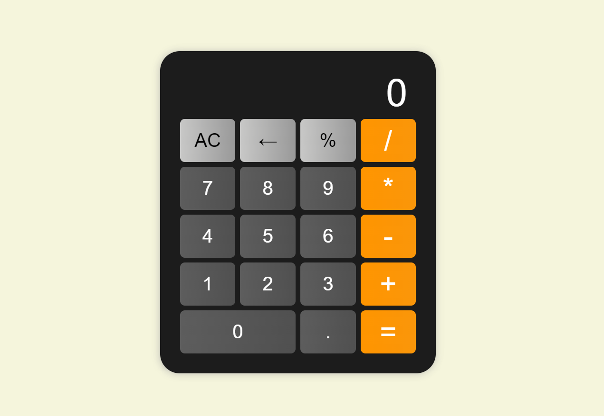

# 🧮Simple Calculator Project

Logic of the app:
Calculator is created for basic operations such as addition, subctraction, division and multiplication.

# Built with

Project is built with HTML, CSS, JavaScript.

# Reach Calculator App

You can reach the project here, [Simple Calculator](https://berenvrl.github.io/js-second-project/)
To start making calculations, you can hover the mouse on the calculator.

# Visual of the project

preview page of the app

